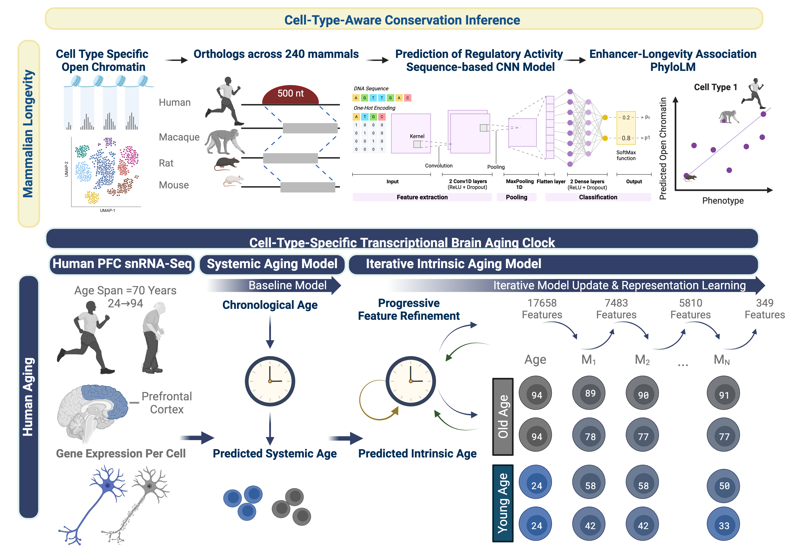

## An Epigenetic Signature of Vulnerable Neurons is Under Selective Pressure Associated with Longevity Across Placental Mammals.

A multi-scale framework to investigate cell-type-specific aging programs and their contribution to cellular vulnerability in neurodegenerative disease.

Preprint: https://doi.org/10.64898/2026.08.20.745782

## Overview

Age is the primary risk factor for neurodegenerative diseases, which are characterized by cell-type-specific vulnerability. Identifying the biological mechanisms underlying brain aging remains challenging because of the complex set of interacting, age-associated biochemical pathways acting across a great diversity of neural cell types and neuron subtypes.

This repository provides the code for a framework that dissects cell-type- and cell-state-specific aging gene regulatory programs and their contribution to cellular vulnerability, by integrating epigenomics, AI methodology, and the natural diversity of lifespan across placental mammals.

This framework systematically integrates evolutionary, tissue-level, and cell-intrinsic dimensions to resolve how regulatory programs of aging emerge and contribute to disease vulnerability.

The framework connects two scales of aging:

1. **Cross-species.** Identify cell-type-specific open chromatin regions (OCRs) whose evolutionary divergence track divergence in species lifespan.
2. **Within-species: Humans.** Transcriptional aging clock decomposes intrinsic aging (cell-autonomous effects) from systemic aging that more broadly influence cells across the entire tissue.
3. **Cross-species to within-species.** Link cross-species lifespan divergence to aging within the human population.

   

## Framework components

The approach integrates these scales through seven components:

1. Resolving neuronal and non-neuronal cortical cell-type-specific longevity-associated regulatory elements (LARs) across 240 mammals using TACIT.
2. Developing a transcriptional brain aging clock to decompose systemic aging from intrinsic aging in cortical neurons within the human population.
3. Resolving cell-type-specific intrinsic aging.
4. Linking intrinsic age to cellular vulnerability and aging hallmarks.
5. Identifying differentially accessible regulatory elements in vulnerable cell types.
6. Integrating cross-species and human-focused analyses to identify shared regulatory elements connecting mammalian longevity with human aging at the cell-type level — vulnerability–longevity-associated regulatory elements (VLRs).
7. Investigating the evolutionary conservation of enhancer–gene synteny for VLRs across 577 vertebrate species.

## 1. System requirements

### Operating system
- Tested on Linux 

### Software dependencies
All dependencies with exact versions are provided as conda environment files in `envs/`:

| Environment file | Used for |
|---|---|
| `envs/singlecell_analysis.yml` | Single-cell processing, iENR aging clock, OLS/GSEA, AUCell scoring, epigenetic erosion, differential accessibility, vulnerability classifiers (R 4.2.3, Python 3.10.9) |
| `envs/tacit_phylolm.yml` | TACIT phylogenetic regression of predicted OCR activity on longevity quotient (R 4.3.3) |
| `envs/tacit_cnn_training.yml` | Cell-TACIT CNN training and cross-species prediction (TensorFlow 2.15.0, Keras 2.15.0, Python 3.10.13) |
| `envs/hal_cnn_training.yml` | ortholog mapping and training/negative set preparation for Cell-TACIT CNNs, including HAL liftover, BEDTools, and GC-matched negatives with BiasAway (Python 3.7.12, R 4.1.3) |
| `envs/hal_vgp_liftover_synteny.yml` | HAL liftover to VGP genomes and enhancer–gene synteny analysis (Python 3.7.12) |

R packages installed outside conda are recorded in `envs/R_sessionInfo_*.txt`.


---

## 2. Installation guide

```bash
git clone https://github.com/pfenninglab/brain-aging-evolution.git
cd brain-aging-evolution

# Environment for the aging clock and single-cell analyses
conda env create -f envs/singlecell_analysis.yml
conda activate SingleCell_Env
```

Create other environments the same way as needed (see table above). R packages not available through conda can be installed from CRAN/Bioconductor at the versions listed in `envs/R_sessionInfo_*.txt`.

---

## 3. Running the aging clock

The aging clock is run on the publicly available Ruzicka et al. (2024) prefrontal cortex snRNA-seq data, processed with `processing/RNA/Ruzicka_snRNA_Seurat_data_prep.R`.

```bash
conda activate SingleCell_Env
python model/Systemic_Aging_Clock_ENR_model_controls_neurons.py        # systemic model (iteration 0)
python model/Intrinsic_Aging_Clock_iENR_model_age_corrected_controls_neurons.py   # intrinsic model (iterations 0-24)
```

**Expected output:**
- Predicted systemic and intrinsic age per cell
- Model coefficients per iteration and the final intrinsic aging signature (349 non-zero coefficient genes; Supplementary Table 4)
- Training/validation MSE, MAE and R² per iteration (Extended Data Fig. 4)

---

## 4. Instructions for use

To apply the aging clock to your own snRNA-seq data:

1. Provide an `.h5ad` (AnnData) object with log-normalized expression, a donor ID column, a donor chronological age column, and per-cell UMI counts (`nCount_RNA`). 
2. Run the systemic model (`model/Systemic_Aging_Clock_ENR_model_controls_neurons.py`), then the iterative intrinsic model (`model/Intrinsic_Aging_Clock_iENR_model_age_corrected_controls_neurons.py`).
3. Score the resulting signatures in any single-cell dataset with AUCell (see `analysis/Human_Aging/Gene_signature_scoring/*_AUCell.R`).

---

## 5. Repository structure and reproduction

```
.
├── envs/            # conda environments and R session info
├── processing/      # dataset processing (Seurat, ArchR)
│   ├── RNA/         # Ruzicka, Anderson, Kamath snRNA-seq
│   └── ATAC/        # Anderson snATAC-seq (ArchR)
├── model/           # systemic (ENR) and intrinsic (iENR) aging clocks and evaluation
├── analysis/
│   ├── Mammalian_Longevity/   # TACIT phylolm, BH correction, GWAS overlap, plots
│   ├── Human_Aging/           # OLS/GSEA, AUCell scoring, classifiers, erosion, differential accessibility
│   └── Intersection/          # VLR identification, phyloP, VGP synteny
└── figures/
```

### Data
All datasets are publicly available (see the manuscript's Data Availability section):
- Human PFC snRNA-seq (Ruzicka et al., 2024)
- Human DLPFC snRNA/snATAC multiome (Anderson et al., 2023) 
- Human SNpc snRNA-seq (Kamath et al., 2022) 
- Cortical snATAC-seq from human, macaque, rat, and mouse (Corces, et al., 2020, Herring et al., 2022, He et al., 2025, Yu et al., 2021, Duttke et al., 2022, Lareau et al., 2019, Li et al., 2021, 10x Genomics) 
- Zoonomia 240-species (Genereux et al., 2020)
- VGP 577-species (Formenti et al., 2026)
- Roadmap Epigenomics ChromHMM E073 (2015)
- AD GWAS summary statistics (Bellenguez et al. 2022)

### Order of execution and figure map

| Step | Scripts | Figures |
|---|---|---|
| Data processing | `processing/RNA/*_Seurat_data_prep.*`, `processing/ATAC/Anderson_snATAC_ArchR_data_processing_prep.ipynb` | — |
| Cell-TACIT CNN training and prediction | TACIT repository (https://github.com/pfenninglab/TACIT) | ED Fig. 1 |
| Longevity association (TACIT) | `analysis/Mammalian_Longevity/TACIT/run_Phylolm.sh`, `ocr_phylolm.r`, `bhCorrection_no_perm.R`, `bh_corrected_ocr_bedfile_prep_no_perm.py` | Suppl. Tables 1–2 |
| LAR enrichment and plots | `analysis/Mammalian_Longevity/LQ_TACIT_plotting.ipynb` | Fig. 2; ED Fig. 2C–D |
| Human-specific LARs | `analysis/Mammalian_Longevity/LQ_TACIT_human_nhp_comparison.ipynb` | ED Fig. 2A–B |
| AD GWAS overlap | `analysis/Mammalian_Longevity/LQ_TACIT_GWAS.ipynb` | ED Fig. 2E; ED Fig. 3 |
| Systemic and intrinsic aging clocks | `model/Systemic_Aging_Clock_ENR_model_controls_neurons.py`, `model/Intrinsic_Aging_Clock_iENR_model_age_corrected_controls_neurons.py` | Suppl. Tables 3–4 |
| Clock evaluation | `model/iENR_Evaluation.ipynb`, `model/iENR_Evaluation_Plotting.ipynb` | Fig. 3A, 3C; ED Fig. 4A–C |
| Random feature comparison | `analysis/Human_Aging/ENR_Ruzicka_feature_sampling_age_prediction.py` | ED Fig. 4D |
| OLS and GSEA | `analysis/Human_Aging/OLS_Ruzicka_*.py`, `analysis/Human_Aging/GSEA_ClusterProfiler.R` | Fig. 3B; ED Fig. 5A–B |
| Signature scoring (AUCell) | `analysis/Human_Aging/Gene_signature_scoring/{Ruzicka,Anderson,Kamath}_snRNA_AUCell.R` | — |
| Signature, composition and hallmark plots | `.../*_AUCell_Plots.ipynb`, `.../Dim_Feature_Plots.ipynb` | Fig. 3D–E; Fig. 4; ED Figs. 5–7 |
| Vulnerability classifiers | `.../Ruzicka_snRNA_Vuln_Classifiers.ipynb`, `.../Anderson_snRNA_Vuln_Classifiers.ipynb` | ED Fig. 9 |
| Epigenetic erosion | `analysis/Human_Aging/Epigenomic_erosion_scoring/step0`–`step6` | Fig. 5A–G; ED Fig. 8 |
| Differential accessibility (VARs) and motifs | `analysis/Human_Aging/Differential_chromatin_accessibility/*` | Fig. 5H–I; Suppl. Table 5 |
| VLR identification | `analysis/Intersection/LQ_Aging_Intersection.ipynb` | Fig. 6A–E; Suppl. Table 6 |
| Nucleotide conservation (phyloP) | `analysis/Intersection/PhyloP/*` | ED Fig. 10 |
| Enhancer–gene synteny across VGP | `analysis/Intersection/Synteny/step0*`, `step2_5-synteny_analysis_LQ_peaks.ipynb` | Fig. 6F–G |

In file names, `neg0`/`pred_age_0` refer to the systemic model (iteration 0) and `neg24`/`pred_age_24` to the final intrinsic model (iteration 24). 

---

## License

This project is licensed under the MIT License — see [LICENSE](LICENSE).

## Citation

Abdelhady G, et al. An Epigenetic Signature of Vulnerable Neurons is Under Selective Pressure Associated with Longevity Across Placental Mammals. bioRxiv (2026). https://doi.org/10.64898/2026.08.20.745782

## Contact

Ghada Abdelhady - gabdelha@andrew.cmu.edu
Andreas R. Pfenning — apfenning@cmu.edu

